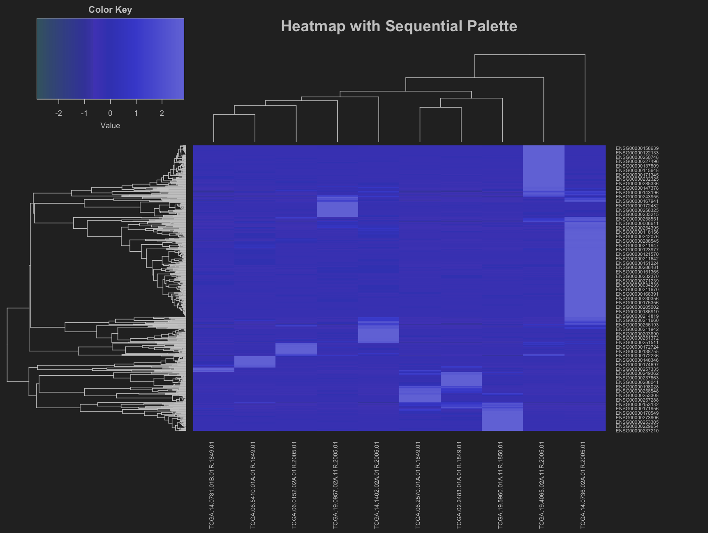
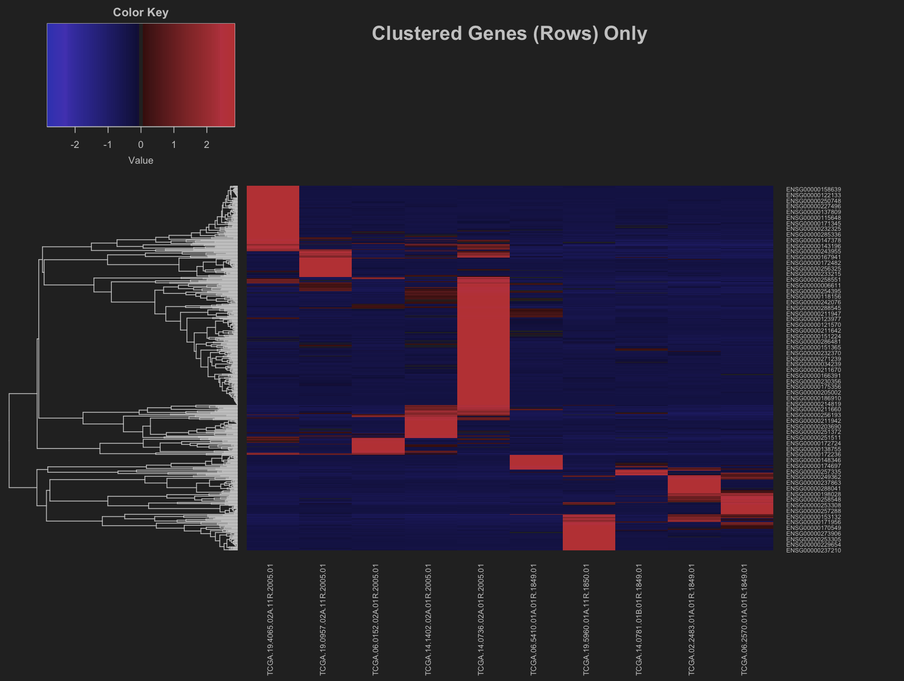
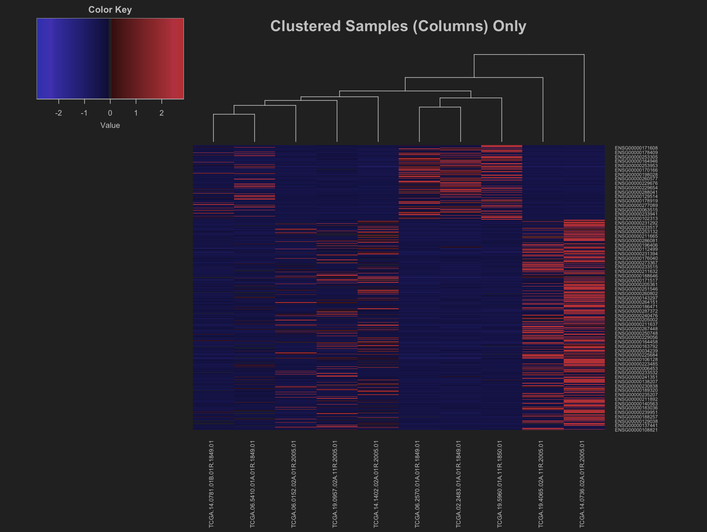
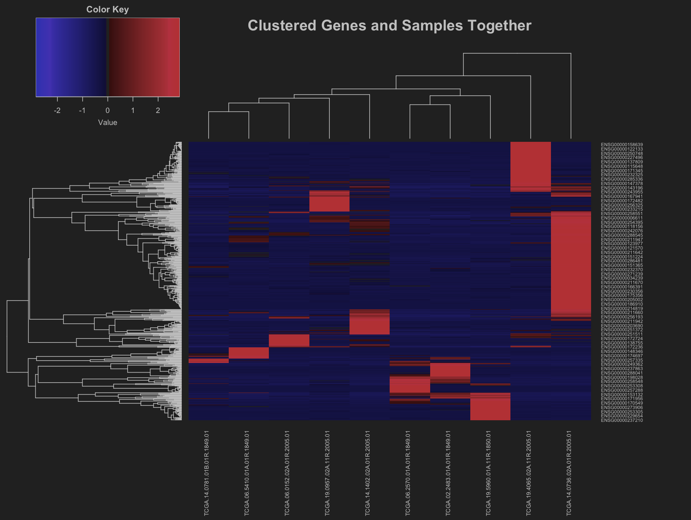
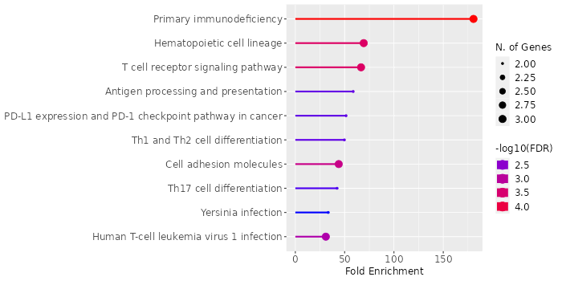
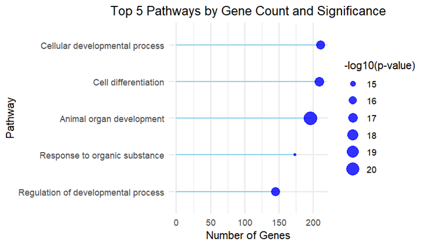

# Stage 2 Task

## Generating Heatmap for Exploring Gene Expression and Downstream Functional Enrichment Analysis of Glioblastoma Dataset

**Contributors:**  
@Oluwakamiye, @Mojoyin, @Nusrat, @Sapi, @Nooran_Alharty, @Berkay, @Josiah

---

## Introduction

Glioblastomas are intrinsic brain tumors hypothesized to originate from neuroglial stem or progenitor cells. In excess
of 90% of glioblastomas are classified as isocitrate dehydrogenase (IDH)-wildtype tumors (Ruhn et al., 2019). Despite
constant efforts to develop novel treatment techniques, primary glioblastomas inevitably resurface as aggressive,
therapy-resistant relapses, and patients succumb to these tumors eventually. Many treatment prescription drugs are
initially explored in clinical trials on recurrent glioblastomas (Campos et al., 2016).

This study aims to examine gene expression data in order to gain significant biological insights, with a special
emphasis on differentially expressed genes under specific conditions (e.g., glioblastoma cell alterations). The goal was
to analyze gene expression patterns using heatmaps and perform functional enrichment analysis to identify major pathways
affected by gene upregulation or downregulation. By clustering genes and samples, researchers intended to uncover
underlying interactions and patterns in the data. To further understand the roles of differentially expressed genes in
disease conditions, deeper biological processes were investigated.

---

## Methods

### Data Preprocessing

We downloaded the glioblastoma.csv gene expression datasets from the provided sources, each containing over 500
differentially expressed genes under different experimental conditions. The datasets were imported into R for analysis.
The dataset was scaled to ensure comparability across genes and samples using Z-score normalization, centering the mean
expression to zero and scaling by the standard deviation to remove any influence of extreme values.

### Heatmap Visualization

We visualized the gene expression data using the `gplots` package in R through a heatmap. The heatmap was generated with
two variants:

1. A diverging color palette (using the `bluered(75)` scheme) highlights the differences between upregulated and
   downregulated genes.
2. A sequential color palette for more subtle gradations in gene expression patterns.

Additionally, three heatmap variations were generated:

1. **Row clustering only:** Genes were clustered based on similarity in expression patterns across samples using
   hierarchical clustering.
2. **Column clustering only:** Samples were clustered based on overall gene expression.
3. **Both row and column clustering:** Both genes and samples were clustered together to identify groups that share
   similar expression profiles.

### Subsetting Significantly Regulated Genes

We established cut-off values for fold change and p-values to subset the significantly regulated genes. A fold change
cut-off of ≥1.5 was set for upregulated genes and ≤-1.5 for downregulated genes, with a p-value cut-off of ≤0.05 to
ensure statistical significance. We filtered genes meeting these criteria and created separate heatmaps for
significantly upregulated and downregulated genes.

---

## Key Findings

### Heatmap Visualization with Divergent and Sequential Color Palettes

To visually display gene expression data, heatmaps were constructed with both sequential and divergent color palettes.
This highlighted the significance of color selection, as divergent palettes successfully highlighted extremes in gene
expression (upregulated vs. downregulated), whereas sequential palettes were smoother, making it easier to trace
progressive changes.

*Fig. 1: Heatmap with diverging color palette*

*Fig. 2: Heatmap with sequential color palette*

### Heatmap Visualization with Clustering Variants

By clustering the genes, samples, or both, the visualizations highlighted distinct groups of co-expressed genes and
samples, aiding in the discovery of gene expression patterns that might correlate with specific biological or
experimental settings.

*Fig. 3: Heatmap clustered genes(rows) only*

*Fig. 4: Heatmap clustered samples(columns) only*

*Fig. 5: Heatmap clustered genes and samples together*

### Subsetting Upregulated and Downregulated Genes

**Upregulated Genes:** Significantly upregulated genes were identified using predefined fold change and p-value cutoffs.
These genes were predominantly engaged in metabolic processes and pathways that promote rapid cell proliferation, such
as riboflavin and fatty acid metabolism.

**Downregulated Genes:** Significantly downregulated genes were implicated in transport pathways, particularly ABC
transporters, which are frequently linked to drug resistance in cancer cells.

| UpRegulated Genes | DownRegulated Genes |
|-------------------|---------------------|
| ENSG00000230936   | ENSG00000287200     |
| ENSG00000287849   | ENSG00000234354     |
| ENSG00000234710   | ENSG00000131355     |
| ENSG00000286404   | ENSG00000230635     |
| ENSG00000259518   |                     |

---

## Functional Enrichment Analysis

We carried out functional enrichment analysis on ShinyGO, and the following top 5 biological process pathways were
reported for our data:

| Enrichment FDR | nGenes | Pathway Genes | Fold Enrichment | Pathway                             |
|----------------|--------|---------------|-----------------|-------------------------------------|
| 1.96E-21       | 196    | 3893          | 2.049473414     | Animal organ development            |
| 1.62E-17       | 209    | 4637          | 1.834762316     | Cell differentiation                |
| 2.06E-17       | 211    | 4731          | 1.8155162       | Cellular developmental process      |
| 2.06E-17       | 145    | 2690          | 2.194251195     | Regulation of developmental process |
| 2.64E-15       | 173    | 3700          | 1.903333977     | Response to organic substance       |

*Fig. 6: Downregulated genes and fold enrichments*

### Upregulated Genes and Fold Enrichments

| Enrichment FDR | nGenes | Pathway Genes | Fold Enrichment | Pathways                                  |
|----------------|--------|---------------|-----------------|-------------------------------------------|
| 3.6E-03        | 1      | 8             | 715             | Riboflavin Metabolism                     |
| 3.2E-07        | 3      | 43            | 399             | Fatty acid degradation                    |
| 1.1E-03        | 2      | 57            | 200.7           | Fatty acid metabolism                     |
| 1.3E-02        | 1      | 36            | 158.9           | Tyrosine metabolism                       |
| 1.3E-02        | 1      | 47            | 121.7           | Pyruvate metabolism                       |
| 1.3E-02        | 1      | 48            | 119.1           | Valine leucine and isoleucine degradation |

*Fig. 7: Upregulated genes and fold enrichments*

---

## Visualization of Biological Process Pathways

In this step, the biological process pathway was plotted using a lolliplot, with the number of genes associated with
each pathway. The plot also reflects the significance of each pathway through the negative log10 of the p-value. The
plot shows that the cellular developmental process pathway had more genes associated with it compared to other pathways;
however, its significance was lower compared to the animal organ development pathway. Of all the top 5 pathways, the
response to organic substance pathway carried the lowest significance.

*Fig. 8: Top 5 pathways by gene count and significance. The length of ech stem represents the number of genes associated
with each pathway, and the size of each point reflects the significance of the pathway(scaled by the negative log10 of
the p-value)*

---

## Description of the Top 3 Enriched Pathways According to Biological Process

1. **Animal Organ Development:** This pathway is involved in the process of differentiation of cells into tissues and
   the development of organs. In the context of glioblastoma, cancer regulation of this pathway may be abnormal (Feng et
   al., 2012).

2. **Cellular Development Process & Cell Differentiation:** These pathways ensure regulated cell growth to produce
   functional tissues and organs. In glioblastoma, processes such as NF-kB and p53 signaling are disrupted (Zhang et
   al., 2018; Sati and Parhar, 2021).

3. **Response to Organic Substances:** This pathway is involved in the behavioral response of cells to environmental
   factors such as drugs. Substances like alkylating agents induce it in glioblastoma (Xie et al., 2023).

---

## Conclusion

In this study, we utilised heatmap visualisations and functional enrichment analysis to
investigate gene expression patterns in glioblastoma. By clustering genes and samples,
we identified distinct groups of co-expressed genes that may correlate with specific
biological processes or disease mechanisms. Our analysis revealed that upregulated
genes were largely involved in pathways promoting rapid cell proliferation, such as
riboflavin and fatty acid metabolism, while downregulated genes were associated with
transport mechanisms, particularly those linked to drug resistance.
Furthermore, functional enrichment analysis highlighted key biological processes in
glioblastoma, including animal organ development, cellular differentiation, and response
to organic substances. These pathways, particularly those involved in cell development
and metabolic processes, offer insight into the molecular mechanisms underlying
glioblastoma progression and potential therapeutic targets.
This analysis provides a deeper understanding of the gene expression dynamics in
glioblastoma and offers potential leads for further research into therapeutic interventions
at disrupting key pathways

---

## References

- Le Rhun, E., Preusser, M., Roth, P., Reardon, D. A., van den Bent, M., Wen, P., Reifenberger, G., & Weller, M. (2019).
  Molecular targeted therapy of glioblastoma. *Cancer treatment reviews*, 80,
    101896. https://doi.org/10.1016/j.ctrv.2019.101896
- Campos, B., Olsen, L. R., Urup, T., & Poulsen, H. S. (2016). A comprehensive profile of recurrent glioblastoma.
  *Oncogene*, 35(45), 5819–5825. https://doi.org/10.1038/onc.2016.85
- Feng, J., Kim, S. T., Liu, W., Kim, J. W., Zhang, Z., Zhu, Y., Berens, M., Sun, J., & Xu, J. (2012). An integrated
  analysis of germline and somatic genetic and epigenetic alterations at 9p21.3 in glioblastoma. *Cancer*, 118, 232-240.
- Sati, I. S. E. E., & Parhar, I. (2021). MicroRNAs regulate cell cycle and cell death pathways in glioblastoma.
  *International journal of molecular sciences*, 22, 13550.
- Xie, M.-Y., Sun, X.-F., Wu, C.-C., Huang, G.-L., Wang, P., Lin, Z.-Y., Liu, Y.-W., Liu, L.-Y., & Zeng, E. Y. (2023).
  Glioma is associated with exposure to legacy and alternative per-and polyfluoroalkyl substances. *Journal of Hazardous
  Materials*, 441, 129819.
- Zhang, Y., Dube, C., Gibert Jr, M., Cruickshanks, N., Wang, B., Coughlan, M., Yang, Y., Setiady, I., Deveau, C., &
  Saoud, K. (2018). The p53 pathway in glioblastoma. *Cancers*, 10, 297.
